<p align="center">
  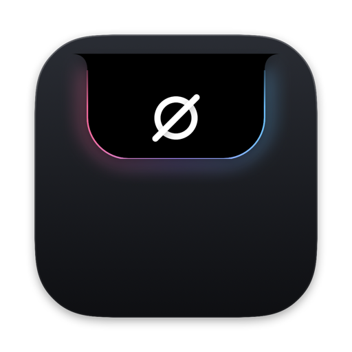
</p>

<h1 align="center">NotchNull</h1>

<p align="center">
  <strong>Any notch you want. Just ask your agent.</strong><br>
  A MacBook notch you rebuild by asking. Tell the Claude Code or Codex on your Mac what it should be: widgets, colors, animations, tabs, even its Settings page. It edits plain files or the source, renders the notch to check its work, and the change is live.
</p>

<p align="center">
  <a href="https://notchnull.vercel.app">Website</a> ·
  <a href="https://github.com/Obed0101/NotchNull/releases/latest">Download</a> ·
  <a href="#build-your-notch">Build your notch</a> ·
  <a href="#built-in">Built in</a> ·
  <a href="#install">Install</a> ·
  <a href="PRIVACY.md">Privacy</a>
</p>

<p align="center">
  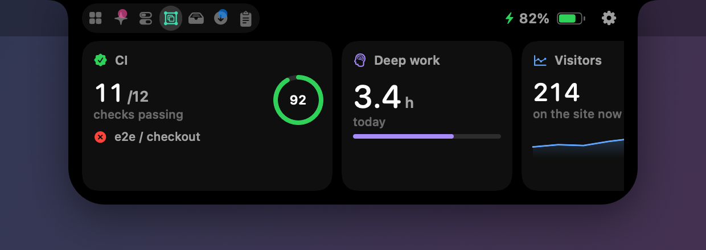
</p>

## Why

Other notch apps ship their notch. NotchNull ships yours.

Every setting is a file, every widget is a file, and your agent can read them, write them and look at the result. When files are not enough, the app itself is open source, and the same skill explains how to change it. Think of it as the Arch Linux of notches: small, fast and built out of pieces you can see.

It is free, open source and runs entirely on your Mac.

## Start with a preset

The first launch opens **Settings › Setup**: pick a shape (**classic notch**, floating **island**, or **automatic**), then **Minimal**, **Balanced** or **Complete** (everything, the way it ships) and one of twelve looks. None of it is fixed. Each preset and look is a JSON file, and after you pick one, your agent can change anything.

**Island mode.** Set a MacBook to a resolution that leaves the notch area out (or use a screen without one) and NotchNull floats as an island inside the menu bar: a clock pill with two satellites that grow into a music card and Control Center on hover. Every activity and the panel work the same. Settings › Style › Shape forces either one.

<p align="center">
  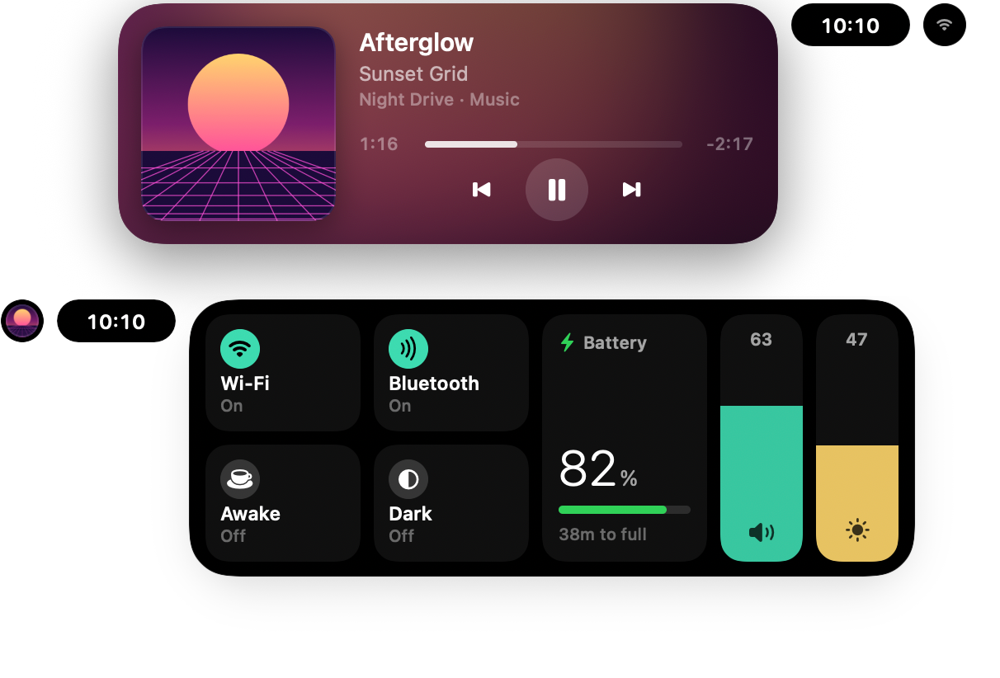
</p>

<p align="center">
  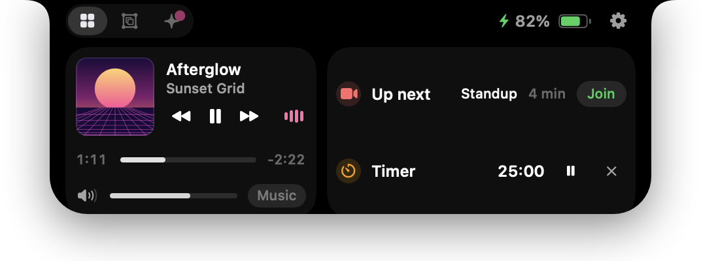
  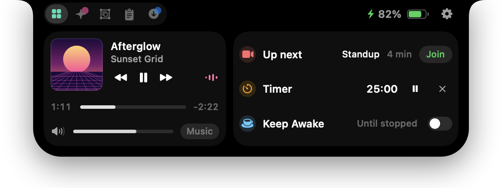
  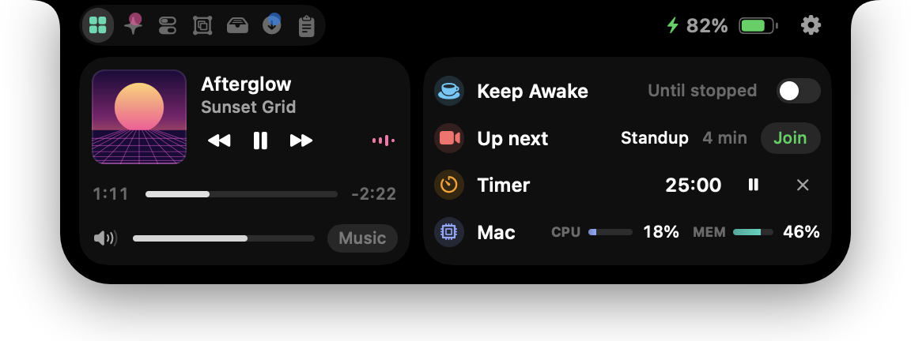
</p>

## Build your notch

Your agent can change all of it:

| Ask for | What it changes |
|---|---|
| “A card with today’s Stripe revenue.” | A widget file in `widgets/`. |
| “A red dot by the camera while prod is down.” | A widget’s `wing`. |
| “Plum, a pink accent, rounder corners.” / “Slower, and no bounce.” | `look` and `motion` in `settings.json`. |
| “Only Home and Widgets, and a wider panel.” | Tabs, Home rows, sizes, which activities appear. |
| “Add a section to Settings with my widgets’ options.” / “A radial gauge.” | The Swift source, which the skill maps out. |

Install the skill from **Settings › Build** (one click each for Claude Code and Codex), then ask:

> Use the notchnull skill: add a widget with my open pull requests, and show a red wing beside the notch while CI is failing.

The agent works in `~/.notchnull`, which the app watches and applies while it runs:

| Path | What it is |
|---|---|
| `widgets/<id>.json` | A widget: a shell command whose output becomes `data`, and a view tree that draws it (values, gauges, bars, sparklines, lists, buttons, badges). Hot-reloaded on save. An optional `wing` slides it out beside the camera while a condition holds. |
| `settings.json` | Every setting, synced both ways with the Settings window. `settings.reference.md` next to it lists each key, generated by the app. |
| `status.json` | What the app made of your files: each widget's state, data and error, and any bad settings. Agents read it instead of guessing. |
| `bin/notchnull` | The CLI. `notchnull show "Deploy finished" --symbol checkmark.circle.fill --tint green`, `notchnull widget ci data '{…}'`, `notchnull settings set '{…}'`. |
| `skill/` | The agent skill: widget format, settings, CLI and local API, and how to change and rebuild the Swift source. |

There is an example of everything in [`skills/notchnull`](skills/notchnull): working widgets in [`examples/`](skills/notchnull/examples) (CI with a wing, open PRs, disk, todo, world clock; **Settings › Build › Examples** adds one in a click), the Setup presets in [`presets/`](skills/notchnull/presets), the looks in [`themes/`](skills/notchnull/themes) and the full references in [`references/`](skills/notchnull/references).

The piece that makes it work is `notchnull render out.png --tab widgets`: it draws the notch with your real files to a PNG, so the agent sees what you will see and fixes it before it tells you it is done.

<p align="center">
  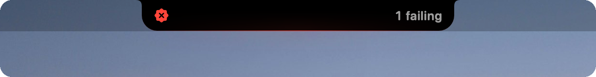
  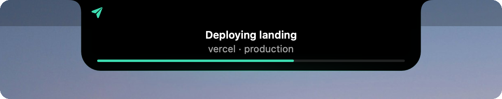
</p>

Scripts can use the same surface: every CLI command is a call to a local API on `127.0.0.1:47823` that needs the per-install token in `~/.notchnull/token`.

## Built in

**AI agents**
- Claude Code and Codex usage limits as **% left**, reset time and a pace forecast that warns when you will run out before the reset.
- Live Claude Code and Codex sessions, detected automatically from their transcripts.
- A glowing **Needs you** alert the moment Claude asks for permission, and a **Done** banner with the agent's final message. Click to jump to the right terminal.
- Tokens used today with an hourly chart.

**Now playing**
- Any player, including videos in your browser: artwork, controls, scrubbing, output volume. Live streams get a LIVE badge.

**Ambient activities** — slide out of the notch as wings, then tuck back in
- Volume and brightness HUD (optionally replaces the system one).
- Charging, low battery, and battery color that follows Low Power / High Power mode.
- Devices: Bluetooth headphones and speakers with AirPods battery, keyboards, mice, controllers, **ESP32 / Arduino boards with their serial port**, drives, displays, AirDrop.
- Downloads with progress, screenshots, timers, meeting countdowns, a hello on login.

**Downloads that clean themselves**
- Each new download asks, right in the notch, how long to keep it: 10 minutes, an hour, a day, a week, 30 days, or Keep. Then it goes to the Trash, with Undo.
- NotchNull follows the file itself, so renaming it is fine and moving it out of Downloads keeps it. Overdue files go when the Mac wakes or the app starts.
- Remember an answer per file type ("Always .dmg"), tag counting-down files as Temporary in Finder, and see every deadline in the Downloads tab.

<p align="center">
  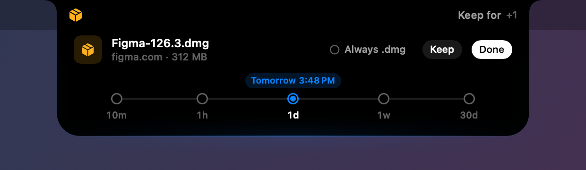
</p>

<p align="center">
  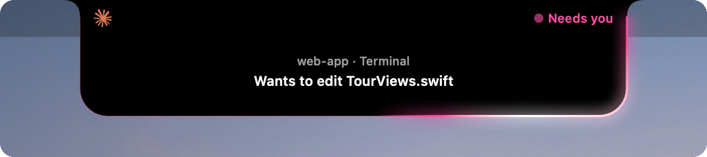
  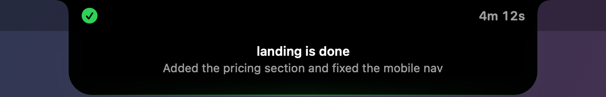
  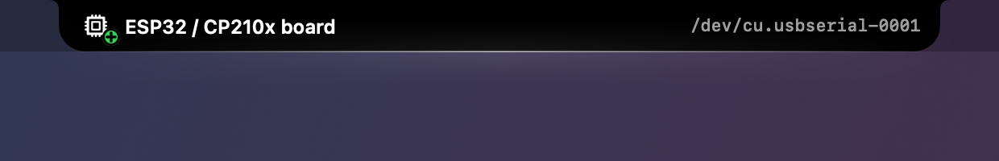
</p>

**Panel**
- Home, Agents, Controls (Wi-Fi, Bluetooth, dark mode, keep awake, lock, sleep, sound output, brightness), Widgets, Downloads, Tray, Clipboard history (encrypted, real file previews).
- **⌃⌘V** opens Clipboard from any app, Raycast style: type to search, arrows to pick, Return pastes (⌘Return only copies). Change or turn off the shortcut in Settings.
- Drag a file toward the notch to park it, copy it or AirDrop it.

**Yours to shape**
- Notch and panel sizes, roundness, black / tinted / glass body, accent (any color, or match the macOS accent), animation speed and bounce, tab order, Home rows and which activities appear. All of it in `settings.json` too.

<p align="center">
  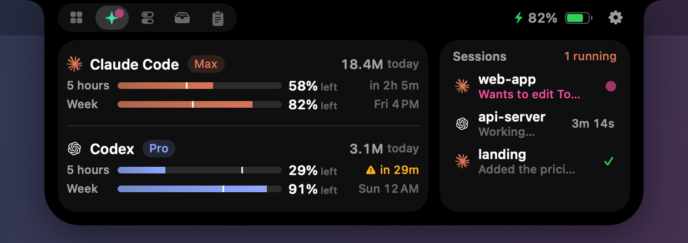
</p>
<p align="center">
  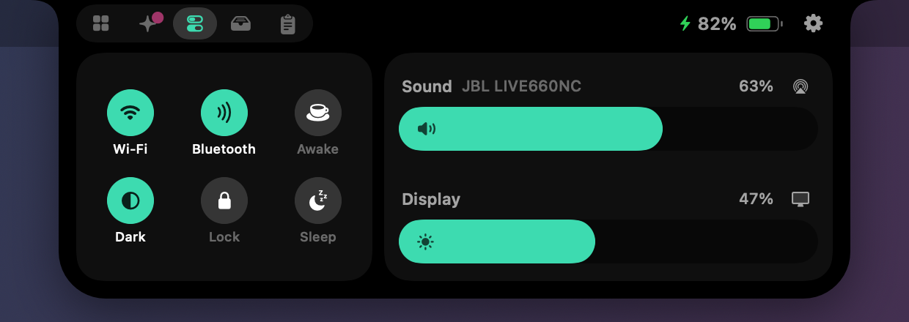
</p>

## Install

1. Download `NotchNull.zip` from the [latest release](https://github.com/Obed0101/NotchNull/releases/latest) and move **NotchNull.app** to Applications.
2. NotchNull is not notarized by Apple yet, so the first launch needs one extra step. Either right-click the app → **Open** → **Open**, or run:

   ```sh
   xattr -dr com.apple.quarantine /Applications/NotchNull.app
   ```

3. Grant only what you want to use; every permission is optional:

| Permission | Used for |
|---|---|
| Accessibility | Replacing the system volume/brightness HUD; pasting from the Clipboard shortcut |
| Calendars | The "Up next" meeting row |
| Bluetooth | Headphone and device connections |
| Camera | The optional mirror tab (off by default) |

Requires macOS 14 or later on a Mac with a notch. On other displays NotchNull draws a virtual notch.

## Privacy

Nothing is collected, and nothing leaves your Mac except one request: your Claude plan's usage is read from Anthropic's API with the Claude Code login already on your Mac. Clipboard history is encrypted at rest. See [PRIVACY.md](PRIVACY.md) for every file NotchNull reads and writes.

## Build from source

Requires Xcode 16 or the Swift 6 toolchain.

```sh
git clone https://github.com/Obed0101/NotchNull.git
cd NotchNull
swift test                     # unit tests
scripts/build-app.sh           # builds build/NotchNull.app
scripts/build-app.sh --install # and copies it to /Applications
```

`.build/debug/NotchNull --snapshots <dir>` renders every state of the notch to PNGs, which is how the screenshots above are made.

## How it works

- **Window:** a borderless panel above the menu bar, click-through except where the notch is.
- **Now playing:** macOS 15.4+ restricts the private MediaRemote framework to Apple-signed processes, so a tiny bridge (`MediaBridge/`) runs inside `/usr/bin/perl` and streams the system's now-playing state as JSON.
- **Platform:** FSEvents watches `~/.notchnull`; widget commands run in your login shell with a timeout and capped output; the CLI and local API share the hook server's token. `notchnull render` runs in its own process and never touches the running app's files.
- **Downloads cleanup:** each download is tracked by a bookmark, so renames follow it; only files still inside Downloads are ever trashed, always to the Trash.
- **Agents:** Claude Code and Codex write session transcripts under `~/.claude` and `~/.codex`; NotchNull tails them. The optional hooks (Settings → Agents) add instant approval alerts and back up your settings first.
- **Devices:** IOKit notifications for USB (serial ports are found from the drivers under each device), IOBluetooth, NSWorkspace for volumes, quarantine records for AirDrop.

## Contributing

Issues and pull requests are welcome — see [CONTRIBUTING.md](CONTRIBUTING.md).

## License

[GPL-3.0](LICENSE). You can use, study, change and share NotchNull; derived apps must stay open under the same license.

Claude is a trademark of Anthropic. OpenAI and Codex are trademarks of OpenAI. Their logos appear in the app only to identify each provider; NotchNull is not affiliated with or endorsed by either company.
