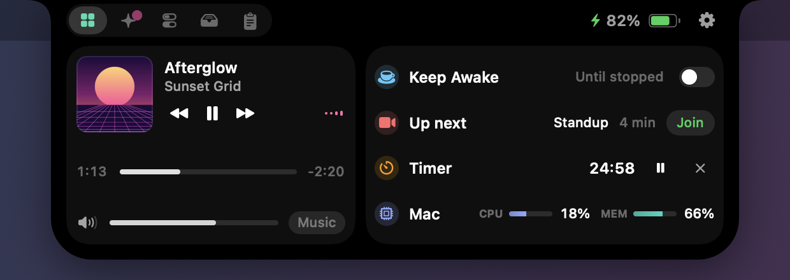

<p align="center">
  
</p>

<h1 align="center">NotchNull</h1>

<p align="center">
  <strong>Your MacBook notch, made useful.</strong><br>
  A live, animated control center that grows out of the camera notch — built for people who ship with Claude Code and Codex.
</p>

<p align="center">
  <a href="https://notchnull.vercel.app">Website</a> ·
  <a href="https://github.com/Obed0101/NotchNull/releases/latest">Download</a> ·
  <a href="#features">Features</a> ·
  <a href="#install">Install</a> ·
  <a href="PRIVACY.md">Privacy</a> ·
  <a href="#build-from-source">Build</a>
</p>

<p align="center">
  
</p>

## Why

The notch is dead space. NotchNull turns it into one black surface that morphs out of the hardware and back — music, your AI agents, system controls and everything that happens on your Mac, one hover away. Every state animates; nothing pops.

It is free, open source and runs entirely on your Mac.

## Features

**AI agents**
- Claude Code and Codex usage limits as **% left**, reset time and a pace forecast that warns when you will run out before the reset.
- Live Claude Code and Codex sessions, detected automatically from their transcripts.
- A glowing **Needs you** alert the moment Claude asks for permission, and a **Done** banner with the agent's final message. Click to jump to the right terminal.
- Tokens used today with an hourly chart.

**Now playing**
- Any player, including videos in your browser: artwork, controls, scrubbing, output volume. Live streams get a LIVE badge.

**Ambient activities** — slide out of the notch as wings, then tuck back in
- Volume and brightness HUD (optionally replaces the system one).
- Charging, low battery, and battery color that follows Low Power / High Power mode.
- Devices: Bluetooth headphones and speakers with AirPods battery, keyboards, mice, controllers, **ESP32 / Arduino boards with their serial port**, drives, displays, AirDrop.
- Downloads with progress, screenshots, timers, meeting countdowns, a hello on login.

<p align="center">
  
  
  
</p>

**Panel**
- Home, Agents, Controls (Wi-Fi, Bluetooth, dark mode, keep awake, lock, sleep, sound output, brightness), Tray, Clipboard history (encrypted, real file previews).
- Drag a file toward the notch to park it, copy it or AirDrop it.

**Yours to shape**
- Notch and panel sizes, roundness, black / tinted / glass body, accent, animation speed and bounce, tab order, Home rows and which activities appear.

<p align="center">
  
</p>
<p align="center">
  
</p>

## Install

1. Download `NotchNull.zip` from the [latest release](https://github.com/Obed0101/NotchNull/releases/latest) and move **NotchNull.app** to Applications.
2. NotchNull is not notarized by Apple yet, so the first launch needs one extra step. Either right-click the app → **Open** → **Open**, or run:

   ```sh
   xattr -dr com.apple.quarantine /Applications/NotchNull.app
   ```

3. Grant only what you want to use; every permission is optional:

| Permission | Used for |
|---|---|
| Accessibility | Replacing the system volume/brightness HUD |
| Calendars | The "Up next" meeting row |
| Bluetooth | Headphone and device connections |
| Camera | The optional mirror tab (off by default) |

Requires macOS 14 or later on a Mac with a notch. On other displays NotchNull draws a virtual notch.

## Privacy

Nothing is collected, and nothing leaves your Mac except one request: your Claude plan's usage is read from Anthropic's API with the Claude Code login already on your Mac. Clipboard history is encrypted at rest. See [PRIVACY.md](PRIVACY.md) for every file NotchNull reads and writes.

## Build from source

Requires Xcode 16 or the Swift 6 toolchain.

```sh
git clone https://github.com/Obed0101/NotchNull.git
cd NotchNull
swift test                     # unit tests
scripts/build-app.sh           # builds build/NotchNull.app
scripts/build-app.sh --install # and copies it to /Applications
```

`.build/debug/NotchNull --snapshots <dir>` renders every state of the notch to PNGs, which is how the screenshots above are made.

## How it works

- **Window:** a borderless panel above the menu bar, click-through except where the notch is.
- **Now playing:** macOS 15.4+ restricts the private MediaRemote framework to Apple-signed processes, so a tiny bridge (`MediaBridge/`) runs inside `/usr/bin/perl` and streams the system's now-playing state as JSON.
- **Agents:** Claude Code and Codex write session transcripts under `~/.claude` and `~/.codex`; NotchNull tails them. The optional hooks (Settings → Agents) add instant approval alerts and back up your settings first.
- **Devices:** IOKit notifications for USB (serial ports are found from the drivers under each device), IOBluetooth, NSWorkspace for volumes, quarantine records for AirDrop.

## Contributing

Issues and pull requests are welcome — see [CONTRIBUTING.md](CONTRIBUTING.md).

## License

[GPL-3.0](LICENSE). You can use, study, change and share NotchNull; derived apps must stay open under the same license.

Claude is a trademark of Anthropic. OpenAI and Codex are trademarks of OpenAI. Their logos appear in the app only to identify each provider; NotchNull is not affiliated with or endorsed by either company.
